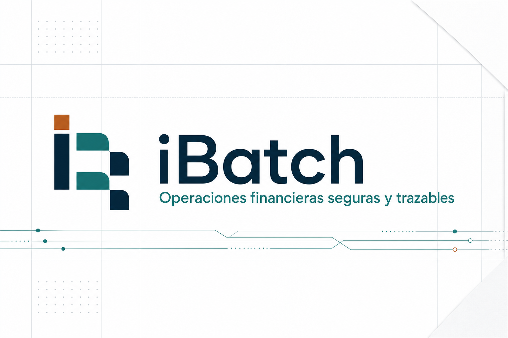
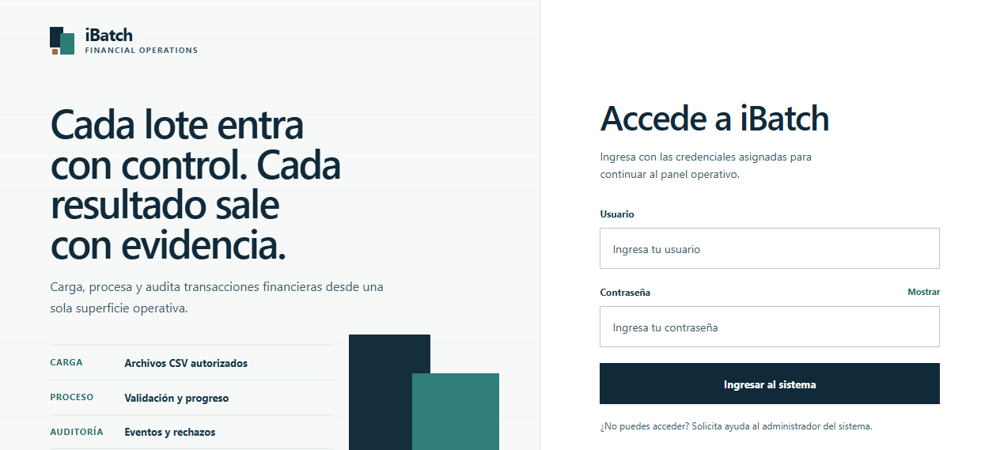
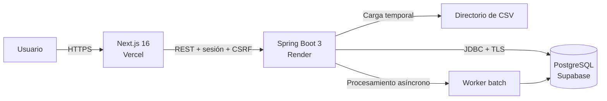

<div align="center">
  

  <br />

  <a href="https://ibatch.vercel.app"><strong>Ver aplicación</strong></a>
  ·
  <a href="https://ibatch.onrender.com/api/health"><strong>Estado de la API</strong></a>
  ·
  <a href="backend/README.md"><strong>Backend</strong></a>
  ·
  <a href="frontend/README.md"><strong>Frontend</strong></a>

  <br />
  <br />

  
  
  
  
  
  
</div>

## Qué es iBatch

iBatch es una aplicación web para cargar, validar, procesar y auditar lotes de transacciones financieras en archivos CSV. Centraliza el ciclo operativo completo: recepción del archivo, procesamiento asíncrono, seguimiento de avance, análisis de rechazos, reprocesamiento y trazabilidad persistente.

El proyecto está construido como una solución full stack con separación de responsabilidades, autenticación basada en sesión y una arquitectura preparada para despliegue en servicios cloud.

## Demo

- **Frontend:** [ibatch.vercel.app](https://ibatch.vercel.app)
- **Backend:** [ibatch.onrender.com](https://ibatch.onrender.com)
- **Health check:** [ibatch.onrender.com/api/health](https://ibatch.onrender.com/api/health)

El acceso a las áreas operativas requiere una cuenta habilitada.

### Credenciales de acceso
**Cuenta administrador:**
- Usuario: admin
- Contraseña: `Administrador123@`
**Cuenta operador:**
- Usuario:** operator
- Contraseña: `Operador123@`

<div align="center">
  
  <p><em>Acceso seguro a la plataforma operativa.</em></p>
</div>

## Funcionalidades

- Carga manual y descubrimiento de archivos CSV disponibles.
- Validación del nombre, tamaño, codificación, encabezados y contenido del archivo.
- Procesamiento asíncrono con escritura por lotes en PostgreSQL.
- Validación independiente de cuenta, monto, fecha y duplicados.
- Seguimiento del progreso durante el procesamiento.
- Historial de archivos con paginación, filtros y detalle por transacción.
- Registro de motivos de rechazo y reprocesamiento controlado.
- Dashboard con indicadores consolidados y causas de rechazo.
- Auditoría persistida, paginada y exportable.
- Autenticación por sesión y autorización por roles.
- Rate limiting para operaciones sensibles.

## Arquitectura



| Capa | Tecnología | Responsabilidad |
| --- | --- | --- |
| Interfaz | Next.js 16, React 19, TypeScript | Flujos operativos, estado visual y consumo de API |
| API | Spring Boot 3.3, Java 21 | Seguridad, validación, procesamiento y reglas de negocio |
| Persistencia | PostgreSQL en Supabase | Transacciones, archivos, usuarios, rechazos y auditoría |
| Contenedores | Docker | Construcción reproducible del backend |
| Despliegue | Vercel y Render | Publicación independiente de frontend y backend |

## Flujo de procesamiento

1. El usuario inicia sesión con un perfil habilitado.
2. Selecciona un archivo disponible o carga uno desde el navegador.
3. iBatch valida el archivo antes de almacenarlo para procesamiento.
4. El backend registra el lote y ejecuta el procesamiento de forma asíncrona.
5. Cada fila pasa por las reglas de cuenta, monto, fecha y duplicados.
6. Los resultados se escriben por lotes y los rechazos conservan su motivo.
7. El usuario consulta el avance, el historial y la evidencia de auditoría.
8. Un administrador puede corregir el monto y reprocesar transacciones elegibles.

## Formato del CSV

El nombre debe respetar el patrón `transactions_DDMMYYYY.csv`, utilizar UTF-8 y contener exactamente estos encabezados:

```csv
cuenta,monto,fecha
1234567890,125.50,16/08/2026
0987654321,79.99,16/08/2026
```

Restricciones predeterminadas:

- Tamaño máximo: **50 MB**.
- Cantidad máxima: **1 000 000 de registros**.
- Encabezados requeridos y ordenados: `cuenta,monto,fecha`.
- Cuenta: exactamente 10 dígitos.
- Monto: valor positivo con un máximo de dos decimales.
- Fecha de transacción: formato `dd/MM/yyyy`.
- La fecha incluida en el nombre debe ser válida.
- No se permite registrar dos veces el mismo archivo.

## Roles y permisos

| Capacidad | `ADMIN` | `OPERATOR` |
| --- | :---: | :---: |
| Iniciar y cerrar sesión | Sí | Sí |
| Cargar y procesar CSV | Sí | Sí |
| Consultar archivos e historial | Sí | Sí |
| Consultar detalle y progreso | Sí | Sí |
| Reprocesar transacciones rechazadas | Sí | No |
| Consultar dashboard y auditoría | Sí | No |
| Verificar la conexión de base de datos | Sí | No |

La autorización se aplica en el backend; ocultar una opción en la interfaz no sustituye el control de permisos del servidor.

## Seguridad

- Contraseñas almacenadas con BCrypt.
- Sesiones HTTP con cookie `HttpOnly`, rotación del identificador al autenticar y configuración `Secure`/`SameSite` para producción.
- Protección CSRF en solicitudes que modifican datos.
- CORS limitado a orígenes configurados explícitamente.
- Consultas JDBC parametrizadas para reducir el riesgo de inyección SQL.
- Validación de entradas con límites de tamaño, formato y paginación.
- Prevención de escritura fuera del directorio autorizado y de sobrescritura de archivos.
- Cabeceras CSP, `X-Frame-Options`, política de referencia y permisos del navegador.
- Respuestas de autenticación y base de datos sin detalles internos sensibles.
- Límites por dirección IP y ventana de un minuto:

| Operación | Límite |
| --- | ---: |
| Intentos de inicio de sesión | 5/minuto |
| Carga de archivos | 3/minuto |
| Inicio de procesamiento | 5/minuto |
| Reprocesamiento | 20/minuto |

> El limitador actual se mantiene en memoria por instancia. Para escalar horizontalmente conviene migrarlo a un almacén compartido como Redis.

## Estructura del repositorio

```text
iBatch/
├── backend/                       # API Spring Boot y pruebas
│   ├── src/main/java/             # Aplicación, dominio e infraestructura
│   ├── src/main/resources/        # Configuración de Spring
│   ├── src/test/                  # Pruebas unitarias y de autorización
│   └── Dockerfile                 # Imagen multi-stage con Java 21
├── database/postgresql/           # Esquema, índices, catálogos y usuarios
├── frontend/                      # Aplicación Next.js
│   ├── app/                       # Login, operaciones, historial y dashboard
│   ├── lib/                       # Cliente de la API
│   └── public/                    # Recursos de marca
├── docs/images/                   # Capturas utilizadas en la documentación
├── DESIGN.md                      # Sistema visual
├── PRODUCT.md                     # Definición del producto
└── README.md
```

## Ejecución local

### Requisitos

- Java 21.
- Maven 3.9 o superior.
- Node.js 22.13 o superior.
- npm.
- PostgreSQL 15 o un proyecto de Supabase.

### 1. Clonar el repositorio

```bash
git clone https://github.com/jacksonandresrosales/iBatch.git
cd iBatch
```

### 2. Preparar PostgreSQL

Ejecute los scripts en orden:

```text
database/postgresql/001_create_batch_processing_model.sql
database/postgresql/002_add_authentication.sql
```

Puede hacerlo desde el SQL Editor de Supabase o mediante `psql`:

```bash
psql -U postgres -d ibatch -f database/postgresql/001_create_batch_processing_model.sql
psql -U postgres -d ibatch -f database/postgresql/002_add_authentication.sql
```

### 3. Configurar y ejecutar el backend

Ejemplo para PowerShell:

```powershell
$env:DB_URL="jdbc:postgresql://localhost:5432/ibatch"
$env:DB_USERNAME="postgres"
$env:DB_PASSWORD="cambia-esta-contrasena"
$env:CORS_ALLOWED_ORIGINS="http://localhost:3000"
$env:SESSION_COOKIE_SECURE="false"
$env:SESSION_COOKIE_SAME_SITE="lax"
$env:IBATCH_ADMIN_USERNAME="admin"
$env:IBATCH_ADMIN_PASSWORD="crea-una-contrasena-segura"
$env:IBATCH_OPERATOR_USERNAME="operator"
$env:IBATCH_OPERATOR_PASSWORD="crea-otra-contrasena-segura"

cd backend
mvn spring-boot:run
```

Las contraseñas iniciales deben tener entre 12 y 72 caracteres. Los usuarios de arranque solo se crean cuando todavía no existen.

### 4. Configurar y ejecutar el frontend

En otra terminal:

```powershell
cd frontend
Copy-Item .env.example .env.local
npm ci
npm run dev
```

Abra [http://localhost:3000](http://localhost:3000). El backend utiliza [http://localhost:8080](http://localhost:8080) de forma predeterminada.

## Variables de entorno

### Backend

| Variable | Uso | Valor local predeterminado |
| --- | --- | --- |
| `DB_URL` | URL JDBC de PostgreSQL | `jdbc:postgresql://localhost:5432/ibatch` |
| `DB_USERNAME` | Usuario de PostgreSQL | `postgres` |
| `DB_PASSWORD` | Contraseña de PostgreSQL | Vacío |
| `DB_DRIVER` | Driver JDBC | `org.postgresql.Driver` |
| `CORS_ALLOWED_ORIGINS` | Orígenes permitidos, separados por coma | `http://localhost:3000` |
| `SESSION_TIMEOUT` | Duración de la sesión | `30m` |
| `SESSION_COOKIE_SECURE` | Envía la cookie solo mediante HTTPS | `false` |
| `SESSION_COOKIE_SAME_SITE` | Política `SameSite` | `lax` |
| `IBATCH_ADMIN_USERNAME` | Usuario administrador inicial | `admin` |
| `IBATCH_ADMIN_PASSWORD` | Contraseña inicial del administrador | Vacío |
| `IBATCH_OPERATOR_USERNAME` | Usuario operador inicial | `operator` |
| `IBATCH_OPERATOR_PASSWORD` | Contraseña inicial del operador | Vacío |
| `APP_FILES_INPUT_DIR` | Directorio temporal de CSV | `input` |
| `MAX_FILE_SIZE_BYTES` | Tamaño máximo del CSV | `52428800` |
| `MAX_FILE_RECORDS` | Filas máximas por archivo | `1000000` |
| `PROCESSING_BATCH_SIZE` | Registros por escritura batch | `500` |

### Frontend

| Variable | Uso | Valor local predeterminado |
| --- | --- | --- |
| `NEXT_PUBLIC_API_BASE_URL` | URL pública del backend | `http://localhost:8080` |

Nunca guarde contraseñas, cadenas de conexión completas ni claves privadas en archivos versionados.

## Docker

Construya la imagen desde la raíz del repositorio:

```bash
docker build -t ibatch-backend ./backend
```

Ejecútela suministrando las variables desde un archivo local no versionado:

```bash
docker run --rm -p 8080:8080 --env-file backend/.env.local ibatch-backend
```

El Dockerfile utiliza una compilación multi-stage: Maven genera el JAR y una imagen JRE de Java 21 ejecuta el artefacto final.

## API principal

| Método | Endpoint | Acceso | Descripción |
| --- | --- | --- | --- |
| `GET` | `/api/health` | Público | Estado general del backend |
| `GET` | `/auth/csrf` | Público | Token CSRF y nombre del encabezado |
| `POST` | `/auth/login` | Público | Inicio de sesión |
| `POST` | `/auth/logout` | Autenticado | Cierre de sesión |
| `GET` | `/auth/me` | Autenticado | Usuario y rol actuales |
| `GET` | `/files/available` | Admin / Operator | CSV disponibles |
| `POST` | `/files/upload` | Admin / Operator | Carga manual de un CSV |
| `POST` | `/files/process` | Admin / Operator | Inicio del procesamiento asíncrono |
| `GET` | `/files/{id}/progress` | Admin / Operator | Progreso del lote |
| `GET` | `/files` | Admin / Operator | Historial de archivos |
| `GET` | `/files/{id}` | Admin / Operator | Detalle paginado y filtrable |
| `POST` | `/transactions/{id}` | Admin | Corrección y reprocesamiento |
| `GET` | `/dashboard/summary` | Admin | Indicadores operativos |
| `GET` | `/dashboard/logs` | Admin | Auditoría paginada |
| `GET` | `/api/health/database` | Admin | Estado de PostgreSQL |

## Pruebas y calidad

Backend:

```bash
cd backend
mvn test
```

Frontend:

```bash
cd frontend
npm run lint
npm run build
```

La suite del backend cubre reglas de validación, procesamiento, persistencia por lotes, autenticación, autorización por roles, rate limiting y controladores. El frontend aplica ESLint, TypeScript y la compilación de producción de Next.js.

## Despliegue

### Frontend en Vercel

- Root Directory: `frontend`
- Framework Preset: Next.js
- Variable: `NEXT_PUBLIC_API_BASE_URL=https://ibatch.onrender.com`

### Backend en Render

- Tipo: Web Service
- Runtime: Docker
- Root Directory: `backend`
- Dockerfile Path: `Dockerfile`
- Health Check Path: `/api/health`
- `CORS_ALLOWED_ORIGINS=https://ibatch.vercel.app`
- `SESSION_COOKIE_SECURE=true`
- `SESSION_COOKIE_SAME_SITE=none`

Las variables de PostgreSQL y las contraseñas iniciales deben registrarse como secretos desde el panel del proveedor.

### Base de datos en Supabase

Utilice PostgreSQL y ejecute las migraciones de `database/postgresql`. El backend se conecta mediante JDBC; no necesita exponer claves de Supabase en el frontend.

## Consideraciones de producción

- El directorio local del contenedor es efímero en muchas plataformas cloud. Los resultados permanecen en PostgreSQL, pero para conservar los CSV originales entre reinicios se recomienda integrar almacenamiento de objetos.
- El rate limiting en memoria es apropiado para una sola instancia. Un despliegue horizontal necesita un contador compartido.
- Las cuentas de demostración deberían ser independientes, con privilegios mínimos y datos descartables.
- La rotación de credenciales y el monitoreo deben gestionarse desde los proveedores de despliegue.

## Próximas mejoras

- Cuenta pública de demostración con datos aislados.
- Almacenamiento persistente de archivos en Supabase Storage u otro servicio compatible.
- Restablecimiento de contraseña y administración de usuarios.
- Pruebas end-to-end automatizadas para el flujo completo.
- Pipeline de integración continua con análisis de seguridad.

## Autor

Desarrollado por [Jackson Andres Rosales](https://github.com/jacksonandresrosales) como proyecto de ingeniería y portafolio.
